# Flow Architecture — Website Monitoring Bot

## 1. Ringkasan Sistem

Aplikasi ini adalah bot monitoring website berbasis Python yang:

- Memantau satu atau banyak website secara paralel.
- Menentukan status setiap website berdasarkan hasil HTTP check.
- Mendeteksi website `UP`, `DOWN`, `RECOVERED`, dan `DEGRADED`.
- Mengirim alert ke Discord melalui Webhook, Discord Bot Token REST API, atau keduanya.
- Menyediakan Interactive Discord Bot dengan prefix command, mention command, dan slash command.
- Menyimpan daftar target secara opsional ke `targets.json`.
- Dapat dijalankan sebagai proses Python biasa, Docker container, Docker Compose service, atau systemd service.

Arsitektur utama aplikasi dapat diringkas sebagai berikut:

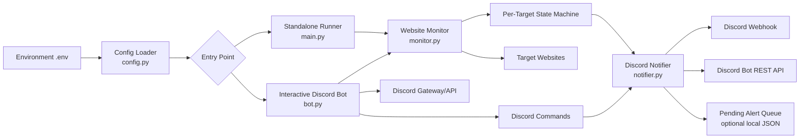

---

## 2. Komponen dan Tanggung Jawab

| Komponen | File | Tanggung jawab |
|---|---|---|
| Configuration Loader | `config.py` | Membaca environment variable, parsing URL, memberi default value, dan menyediakan konfigurasi terpusat. |
| Standalone Entrypoint | `main.py` | Menentukan mode aplikasi melalui CLI, membuat runner monitoring, menjalankan check sekali atau loop monitoring. |
| Interactive Bot | `bot.py` | Menjalankan Discord Bot, menerima command user, mengelola target secara realtime, dan menjalankan monitoring background. |
| Website Monitor | `monitor.py` | Melakukan HTTP check, mengukur latency, memeriksa SSL, dan menjalankan transisi state per website. |
| Discord Notifier | `notifier.py` | Membentuk payload/embed Discord, mengirim alert, menjalankan retry/failover, circuit breaker, dan queue alert gagal. |
| Tests | `tests/` | Menguji konfigurasi, hasil check, transisi state, notifikasi, command logic, dan persistence target. |
| Container Runtime | `Dockerfile`, `docker-compose.yml` | Menjalankan aplikasi sebagai container non-root dengan restart policy. |
| Server Runtime | `systemd/bot-monitoring.service` | Menjalankan standalone monitoring sebagai service Linux dengan auto-restart. |

---

## 3. Sumber Konfigurasi

### 3.1 Environment Variable

Konfigurasi utama dibaca oleh `Config.from_env()` dari `.env` atau environment sistem.

| Variable | Fungsi | Default / aturan |
|---|---|---|
| `TARGET_URLS` | Daftar target website | Dipisahkan koma atau newline. |
| `TARGET_URL` | Format target tunggal lama/backward compatibility | Dipakai jika `TARGET_URLS` kosong. |
| `DISCORD_WEBHOOK_URL` | Endpoint Discord Webhook | Opsional. |
| `DISCORD_BOT_TOKEN` | Token Discord Bot | Dibutuhkan untuk mode interactive bot. |
| `DISCORD_CHANNEL_ID` | Channel tujuan pesan REST API | Dibutuhkan bersama bot token untuk notifikasi REST. |
| `CHECK_INTERVAL_SECONDS` | Jeda antar siklus monitoring | Minimum efektif 5 detik. Default 60 detik. |
| `REQUEST_TIMEOUT_SECONDS` | Batas waktu HTTP request | Minimum efektif 1 detik. Default 10 detik. |
| `FAILURE_THRESHOLD` | Jumlah kegagalan beruntun sebelum status DOWN | Minimum 1. Default 1. |
| `ALERT_MENTION` | Mention saat alert tertentu | Contoh `@everyone` atau role mention. |
| `DEGRADED_LATENCY_THRESHOLD_MS` | Ambang latency lambat | Default 3000 ms. Nilai 0 menonaktifkan alert degraded. |
| `ENABLE_SSL_CHECK` | Mengaktifkan pemeriksaan expiry SSL | Default aktif. |
| `TARGETS_FILE` | File persistence daftar target interactive bot | Default `targets.json`. |

### 3.2 Normalisasi Konfigurasi

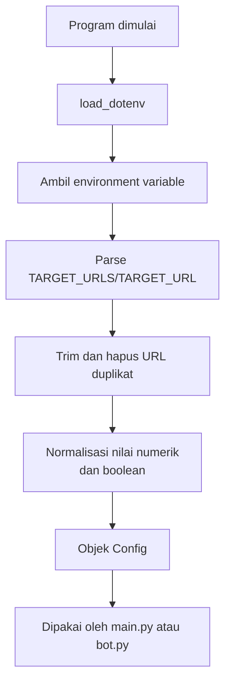

Jika tidak ada URL yang dikonfigurasi, aplikasi menggunakan target default yang ditentukan di `config.py`.

---

## 4. Entry Point dan Mode Operasi

Aplikasi memiliki dua entry point utama:

### 4.1 Standalone Monitoring — `main.py`

Digunakan untuk monitoring tanpa command interaktif Discord.

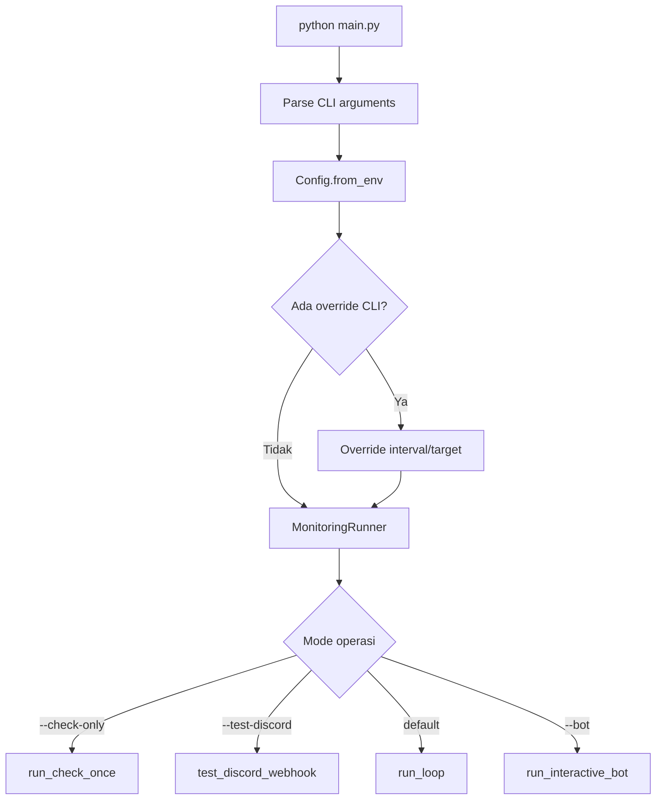

Command yang tersedia:

- `python main.py` — monitoring berkelanjutan.
- `python main.py --check-only` — satu kali check seluruh target lalu keluar.
- `python main.py --check-only --target "https://a.com,https://b.com"` — check target override.
- `python main.py --test-discord` — menguji koneksi/pengiriman Discord.
- `python main.py --interval 30` — override interval.
- `python main.py --bot` — menjalankan interactive bot.

### 4.2 Interactive Discord Bot — `bot.py`

Mode ini menggabungkan Discord Bot Gateway dengan background monitoring.

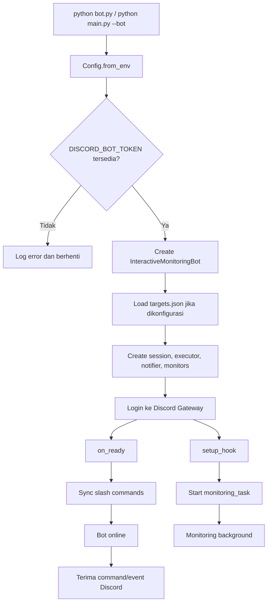

Jika koneksi Discord terputus, `run_interactive_bot()` melakukan retry dengan delay yang meningkat secara bertahap sampai batas maksimum. Login failure menghentikan retry karena token dianggap tidak valid atau revoked.

---

## 5. Arsitektur Monitoring

Setiap URL dibuatkan satu instance `WebsiteMonitor`. State setiap website bersifat independen sehingga kegagalan satu target tidak mengubah status target lain.

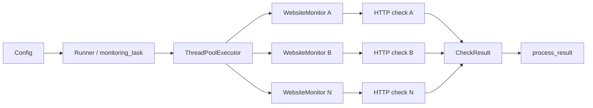

### 5.1 Eksekusi Paralel

- `main.py` menggunakan `ThreadPoolExecutor` reusable.
- Setiap target diproses sebagai future terpisah.
- Jumlah worker standalone dibatasi maksimum 20 dan menyesuaikan jumlah target.
- Interactive bot memakai executor untuk menjalankan blocking `requests` tanpa memblokir event loop asyncio.
- Satu target yang lambat/error tidak menghentikan check target lain.

### 5.2 HTTP Check

Method `WebsiteMonitor.check()` melakukan:

1. Memulai pengukuran waktu dengan `time.perf_counter()`.
2. Mengirim HTTP `GET` menggunakan `requests.Session`.
3. Menggunakan `stream=True` agar cukup mengambil header tanpa mengunduh seluruh body.
4. Mengikuti redirect.
5. Menggunakan custom User-Agent.
6. Mengukur response latency.
7. Menutup response.
8. Menghasilkan objek `CheckResult`.

Klasifikasi HTTP:

| Kondisi | Hasil |
|---|---|
| HTTP 200–399 | Healthy / UP |
| HTTP 400–599 | Unhealthy / failure |
| Timeout | Unhealthy dengan pesan timeout |
| SSL error | Unhealthy dengan pesan SSL/TLS |
| Connection/DNS error | Unhealthy dengan pesan koneksi |
| Request exception lain | Unhealthy dengan pesan exception |

### 5.3 Pemeriksaan SSL

Untuk target HTTPS yang healthy:

- Hostname dan port diambil dari URL.
- Sertifikat diperiksa menggunakan modul standar `ssl` dan `socket` Python.
- Sisa masa berlaku dihitung dalam hari.
- Hasil dicache berdasarkan hostname selama 6 jam.
- Jika expiry `<= 14 hari`, dicatat sebagai warning.
- Jika expiry `<= 7 hari`, alert SSL dikirim maksimal satu kali per 24 jam per monitor.
- Kegagalan pemeriksaan SSL tidak membuat HTTP check menjadi unhealthy; nilai SSL dikembalikan sebagai `None`.

---

## 6. State Machine Per Website

State disimpan di instance `WebsiteMonitor`, bukan di database.

### 6.1 State Internal

| Properti | Fungsi |
|---|---|
| `is_currently_down` | Menandakan target sudah dianggap DOWN. |
| `consecutive_failures` | Jumlah failure berturut-turut. |
| `down_since` | Timestamp saat status DOWN dimulai. |
| `last_degraded_alert` | Timestamp alert latency terakhir. |
| `last_ssl_alert` | Timestamp alert SSL terakhir. |

### 6.2 Diagram Transisi

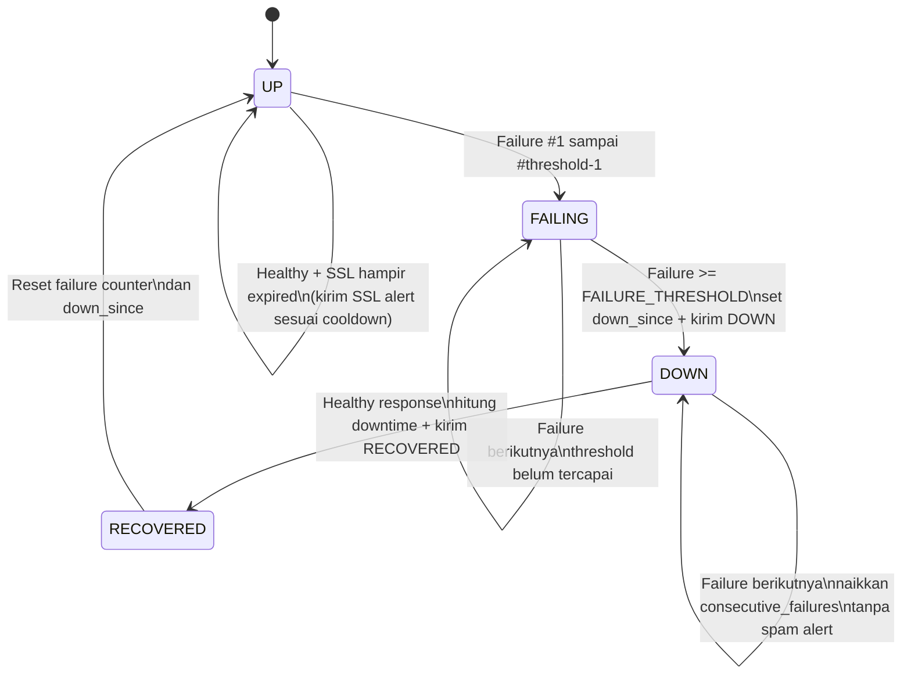

### 6.3 Aturan Anti-Flapping

1. Failure counter bertambah hanya ketika check gagal.
2. Alert DOWN hanya dikirim saat threshold tercapai dan target belum berstatus DOWN.
3. Failure berikutnya ketika target sudah DOWN tidak mengirim alert DOWN tambahan.
4. Satu response healthy mereset failure counter.
5. Jika sebelumnya DOWN, response healthy memicu alert RECOVERED satu kali.
6. Downtime dihitung dari `down_since` sampai waktu recovery.

---

## 7. Flow Siklus Monitoring Standalone

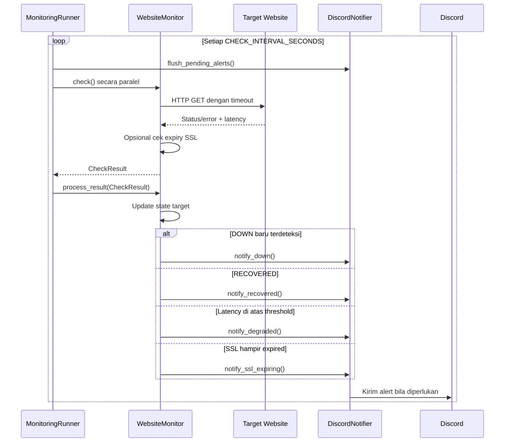

Loop standalone menunggu interval dalam potongan satu detik, bukan sleep sekali penuh. Tujuannya agar `SIGINT` atau `SIGTERM` dapat diproses lebih cepat.

---

## 8. Flow Background Monitoring Interactive Bot

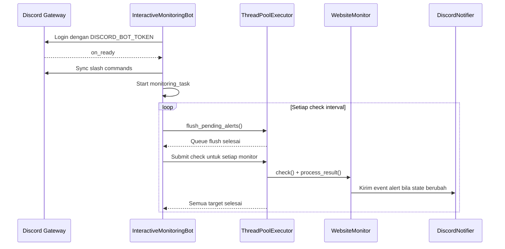

`monitoring_task` memakai `asyncio` sebagai scheduler, tetapi HTTP request blocking dikerjakan oleh thread executor agar Discord Bot tetap responsif terhadap command.

---

## 9. Arsitektur Notifikasi Discord

### 9.1 Sumber Alert

| Event | Method notifier | Warna embed |
|---|---|---|
| Website gagal melewati threshold | `notify_down()` | Merah |
| Website kembali normal | `notify_recovered()` | Hijau |
| Response terlalu lambat | `notify_degraded()` | Kuning |
| SSL mendekati expiry | `notify_ssl_expiring()` | Oranye |
| Tes koneksi manual | `notify_test()` | Biru |

### 9.2 Jalur Pengiriman

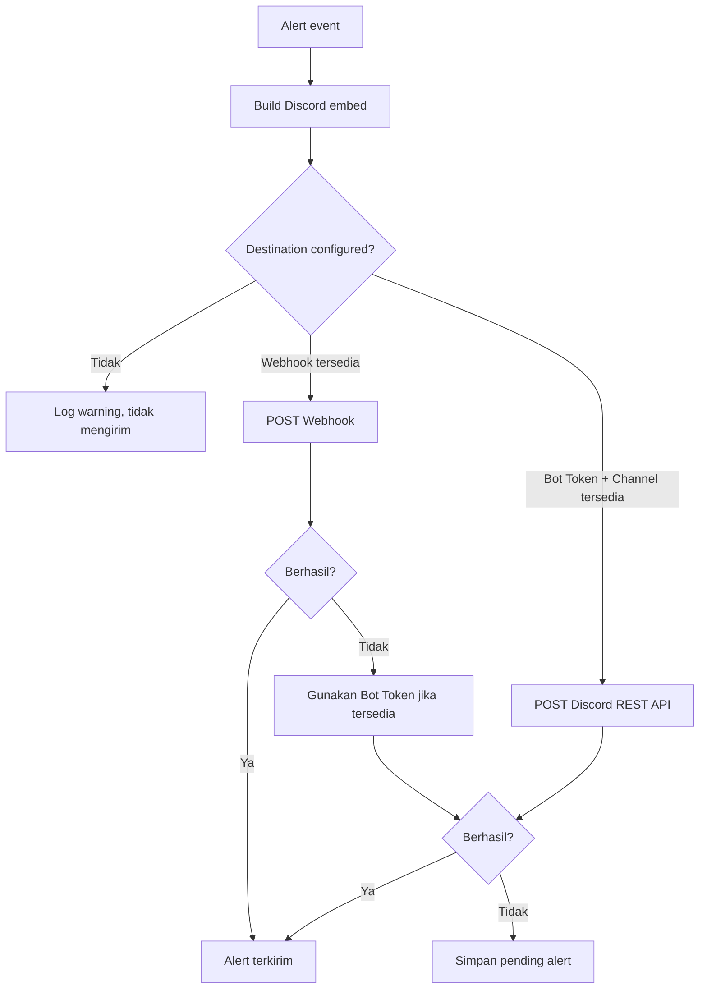

Jika Webhook dan Bot Token sama-sama tersedia, implementasi dapat mengirim melalui kedua jalur ketika Webhook berhasil; Bot Token juga berfungsi sebagai failover ketika Webhook gagal.

### 9.3 Retry dan Circuit Breaker

- Setiap jalur pengiriman mencoba maksimal 3 kali.
- HTTP `429` membaca `retry_after`, lalu menunggu sebelum mencoba kembali.
- Error koneksi mencoba ulang dengan jeda 2 detik.
- HTTP `401`, `403`, atau `404` dianggap error permanen sementara dan menonaktifkan jalur tersebut melalui flag circuit breaker.
- Alert hanya dianggap sukses jika minimal satu destination berhasil mengirim.

### 9.4 Pending Alert Queue

Jika seluruh destination gagal:

1. Payload alert dimasukkan ke `pending_alerts`.
2. Queue dibatasi maksimal 50 item; item terlama dibuang jika melebihi batas.
3. Jika `failed_queue_file` dikonfigurasi, queue disimpan ke file JSON.
4. Pada awal setiap siklus monitoring, `flush_pending_alerts()` mencoba mengirim ulang.
5. Item yang sukses dihapus dari queue; item yang masih gagal dipertahankan.

Catatan implementasi: pada konfigurasi saat ini, `DiscordNotifier` dibuat tanpa `failed_queue_file`, sehingga queue default hanya berada di memory dan tidak bertahan setelah proses mati. Persistence queue baru aktif jika parameter file diberikan.

---

## 10. Flow Interactive Discord Command

### 10.1 Input Command

Bot menerima tiga pola command:

- Prefix `s!`, `S!`, atau `!`.
- Mention bot, misalnya `@Bot status`.
- Slash command, misalnya `/status`.

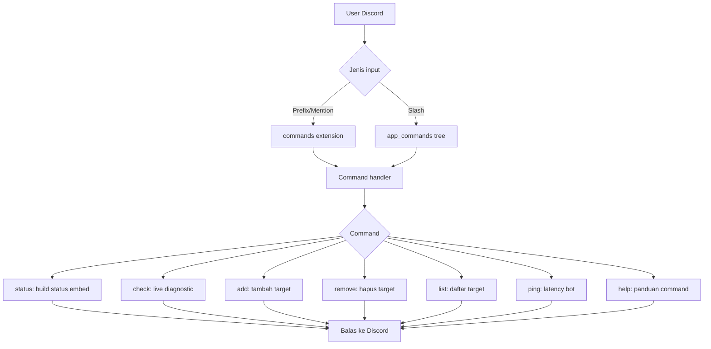

### 10.2 `status`

- Membaca status internal seluruh monitor.
- Jika semua target tidak DOWN, embed berstatus `All Systems Operational`.
- Jika minimal satu target DOWN, embed berstatus `Outages Detected`.
- Menampilkan status tiap URL dan jumlah failure jika DOWN.

### 10.3 `check`

- Menjalankan live diagnostic tanpa mengubah state monitor utama.
- Membuat `WebsiteMonitor` sementara untuk tiap target.
- Check beberapa target secara paralel.
- Menampilkan HTTP status, latency, SSL expiry bila tersedia, atau error.

### 10.4 `add`

1. Trim URL.
2. Menambahkan `https://` jika protocol belum ada.
3. Menolak URL duplikat.
4. Menambahkan URL ke `config.target_urls`.
5. Membuat `WebsiteMonitor` baru.
6. Menyimpan daftar ke `targets.json` jika persistence aktif.
7. Mengirim embed hasil operasi.

### 10.5 `remove`

1. Mencocokkan URL secara langsung atau dengan mengabaikan trailing slash.
2. Menghapus URL dari konfigurasi.
3. Menghapus monitor terkait.
4. Menyimpan daftar terbaru ke persistence file.
5. Mengirim embed hasil operasi.

---

## 11. Persistence Data Lokal

Aplikasi tidak menggunakan database. Data runtime utama berada di memory.

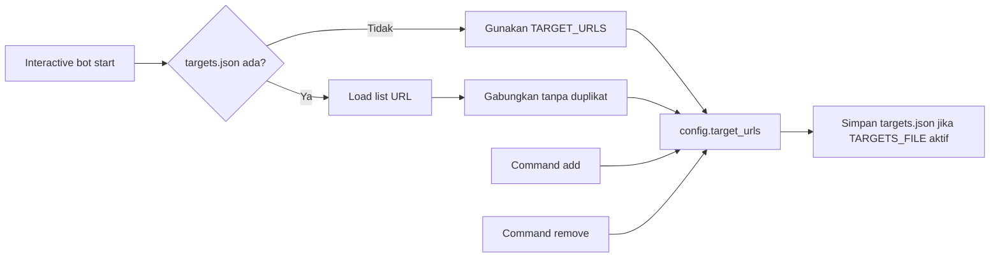

Data yang tidak dipersistenkan:

- Status UP/DOWN.
- Jumlah consecutive failures.
- `down_since`.
- Timestamp cooldown alert.
- Pending alert queue, kecuali `failed_queue_file` dikonfigurasi pada notifier.

Akibatnya, restart aplikasi akan membuat state monitoring kembali dari awal.

---

## 12. Lifecycle dan Graceful Shutdown

### Standalone

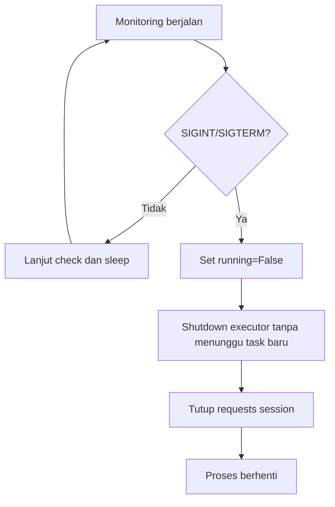

### Interactive Bot

`InteractiveMonitoringBot.close()`:

1. Shutdown executor.
2. Menutup HTTP session.
3. Memanggil `super().close()` untuk menutup koneksi Discord.

Jika user menekan `KeyboardInterrupt`, lifecycle wrapper menghentikan loop retry dan proses berakhir dengan log yang sesuai.

---

## 13. Deployment Flow

### 13.1 Docker / Docker Compose

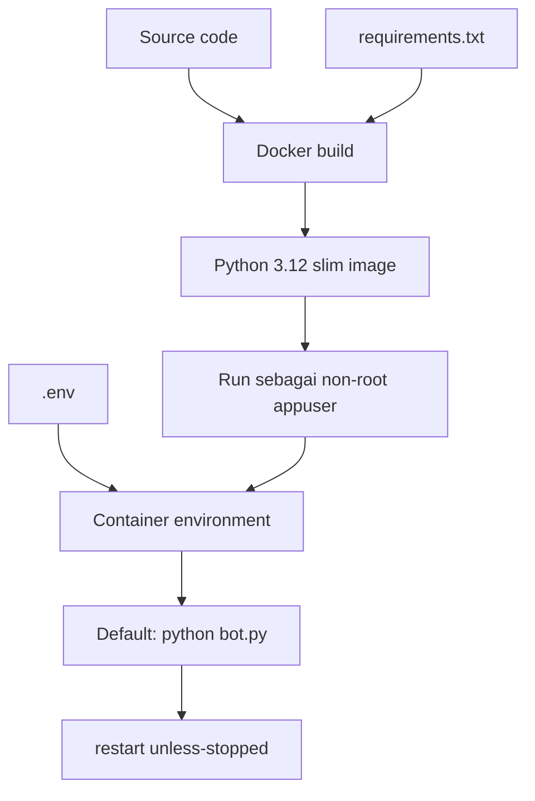

Default Docker command adalah interactive bot:

```bash
docker compose up -d
```

Untuk mode standalone, command Compose dapat diganti menjadi `python main.py`.

### 13.2 Systemd

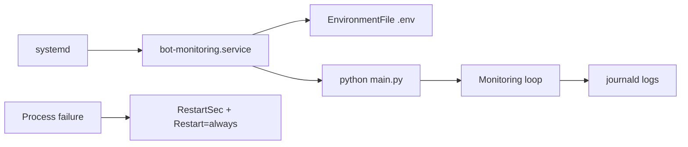

Service systemd menjalankan mode standalone dan mengirim stdout/stderr ke journal.

---

## 14. Testing Architecture

Test suite menggunakan `pytest` dan mock agar tidak perlu mengakses website atau Discord sungguhan.

| File test | Cakupan |
|---|---|
| `tests/test_config.py` | Parsing URL, default value, dan konfigurasi environment. |
| `tests/test_monitor.py` | HTTP 200, HTTP 500, timeout, connection error, state transition, multi-monitor state, dan SSL expiry. |
| `tests/test_notifier.py` | Payload alert, Webhook, Bot Token REST API, retry/failover, dan queue. |
| `tests/test_bot.py` | Inisialisasi bot, add/remove target, status embed, live diagnostic, dan persistence target. |

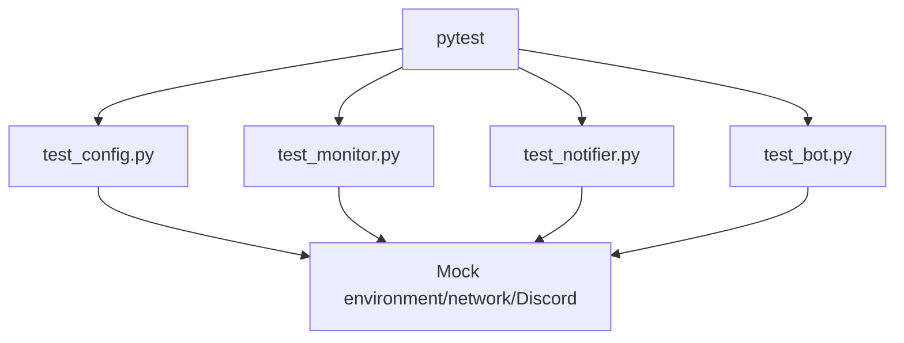

---

## 15. Alur Error dan Recovery

### Website Error

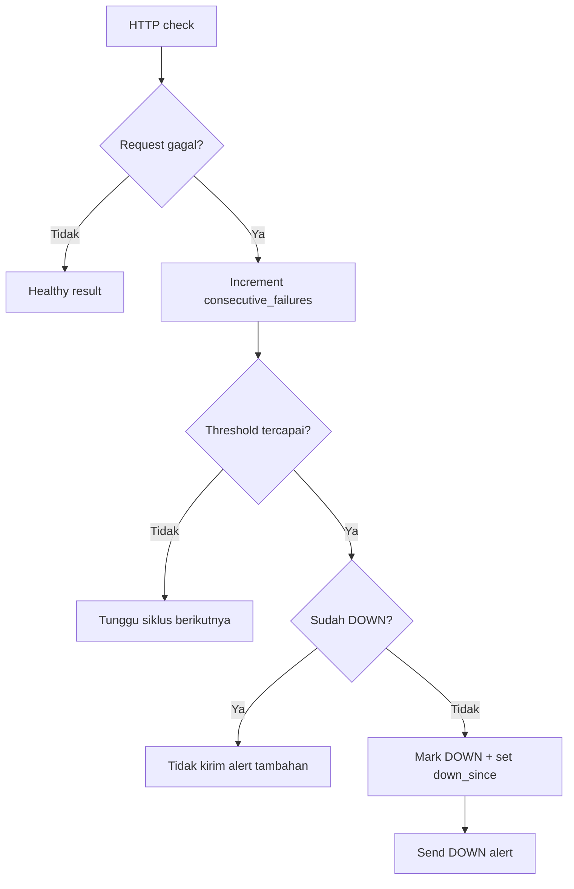

### Discord Error

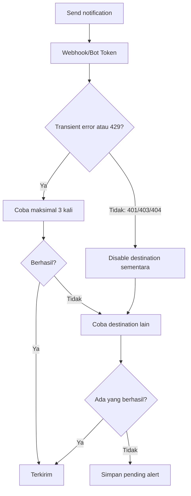

---

## 16. Ringkasan Alur End-to-End

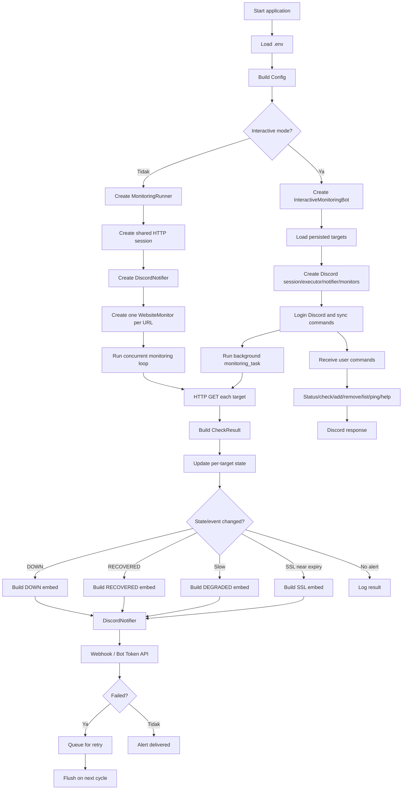

---

## 17. Catatan Arsitektur Penting

1. **Tidak ada database eksternal.** State dan target aktif disimpan di memory; target dapat disimpan ke JSON.
2. **Monitoring bersifat per target.** Setiap website mempunyai state machine sendiri.
3. **HTTP check bersifat blocking.** Karena itu standalone memakai thread pool dan interactive bot memindahkan pekerjaan blocking ke executor.
4. **Notifikasi bersifat event-driven.** Alert tidak dikirim pada setiap siklus, hanya ketika event memenuhi aturan state/cooldown.
5. **Anti-flapping dikontrol `FAILURE_THRESHOLD`.** Ini mencegah satu glitch singkat langsung menghasilkan alert DOWN.
6. **Latency alert memiliki cooldown 15 menit.** SSL alert memiliki cooldown 24 jam untuk expiry `<= 7 hari`.
7. **Alert recovery membutuhkan state DOWN sebelumnya.** Website yang selalu healthy tidak mengirim RECOVERED.
8. **Mode interactive memerlukan `DISCORD_BOT_TOKEN`.** Webhook saja tidak cukup untuk login ke Discord Gateway dan menerima command.
9. **Mode standalone dapat memakai Webhook atau Bot Token + Channel ID.**
10. **Graceful shutdown tersedia untuk signal proses dan penutupan interactive bot.**

## 18. Referensi File Utama

- `config.py:11` — struktur dan parsing konfigurasi.
- `main.py:23` — `MonitoringRunner` dan lifecycle standalone.
- `main.py:178` — CLI entrypoint.
- `monitor.py:58` — `CheckResult`.
- `monitor.py:69` — `WebsiteMonitor`.
- `monitor.py:94` — HTTP check.
- `monitor.py:170` — state transition dan alert decision.
- `notifier.py:20` — `DiscordNotifier`.
- `notifier.py:172` — routing notifikasi dan failover.
- `notifier.py:220` — pengiriman Webhook.
- `notifier.py:262` — pengiriman Bot Token REST API.
- `bot.py:32` — `InteractiveMonitoringBot`.
- `bot.py:141` — background monitoring task.
- `bot.py:275` — registration prefix dan slash commands.
- `bot.py:446` — interactive bot lifecycle dan reconnect.
